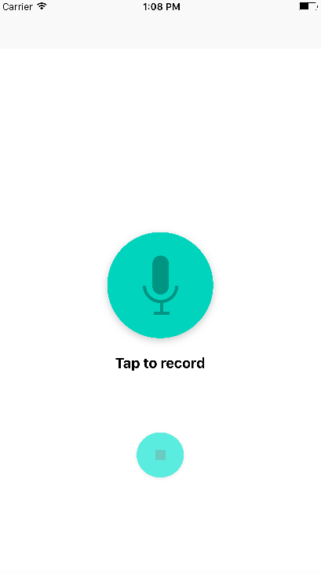
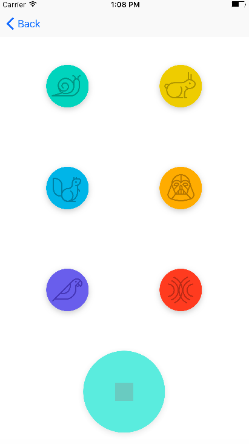
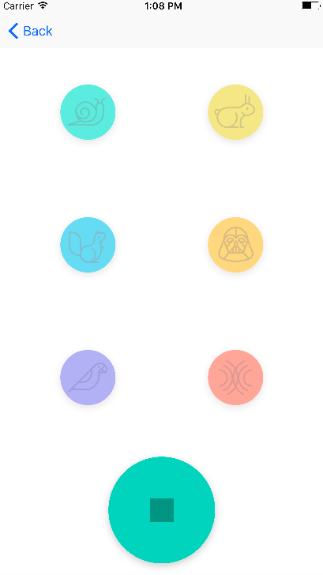

# Pitch Perfect

PitchPerfect is an iOS app which takes audio input from the user and manipulates the input's pitch, pace, echo and reverb properties to create a new sounding output. 
Created as the first project of my Udacity iOS Nanodegree.

### Lessons learnt

  - Setting up XCode environment
  - UI basics, IBOutlets and IBActions, segue and Navigation basics
  - Interaction with AVFoundation and other frameworks

### Screenshots

        </img>
        </img>
        </img>

